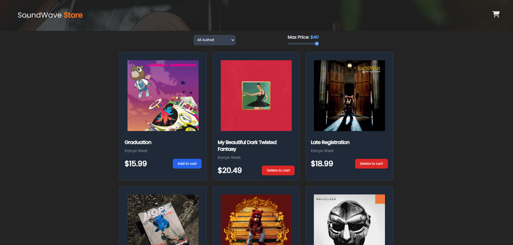
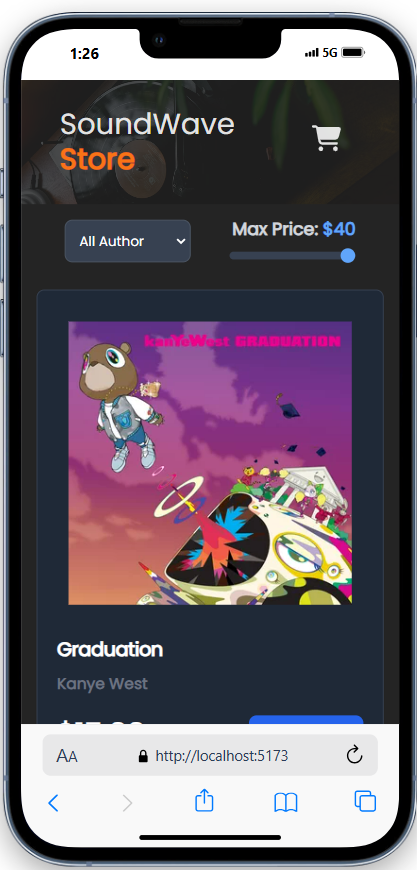

# 🛒 Shopping Cart Albums

Bienvenido a **Shopping Cart Albums**, una app donde puedes explorar y agregar álbumes a tu carrito de compras. La aplicación es completamente **responsive** y utiliza diferentes tecnologías y herramientas de React para su desarrollo.

## 🚀 Demo en Vivo

¡Prueba la aplicación en vivo! Haz clic en el siguiente enlace para acceder a la demo de la tienda de álbumes:

🔗 [Demo en vivo](http://example.com/ "Title")

## ⚙️ Tecnologías Utilizadas

- React ⚛️: La biblioteca principal para construir interfaces de usuario.
- Hooks de React 🔑:
  - **useState**: Para manejar el estado de los álbumes, el carrito, y los filtros.
  - **useEffect**: Para realizar acciones secundarias, como obtener los álbumes de un JSON.
  - **Custom Hooks** 💡: Creación de hooks personalizados para los filtros o el carrito de compras.
- Tailwind CSS 🎨: Utilizado para hacer la aplicación responsive y darle estilo de manera rápida y sencilla.

## 🌍 Características

- Vista adaptativa (Responsive) 📱💻:
  - La interfaz se adapta a diferentes tamaños de pantalla (móviles, tabletas y escritorios) gracias a Tailwind CSS.
  - Los filtros y las tarjetas de los álbumes cambian de disposición dependiendo del tamaño de la pantalla.
- Carrito de Compras 🛍️:
  - Los usuarios pueden agregar y eliminar álbumes en su carrito.
  - Los álbumes se mantienen guardados incluso después de refrescar la página (gracias al estado y el almacenamiento en local).
- Filtros 🎤:
  - Puedes seleccionar el autor de los álbumes desde un select que filtra los resultados mostrados.
  - Tambien puedes filtrar por el precios de los albums.

## 📦 Instalación y Uso

1. Para empezar con el proyecto, sigue estos pasos:

```bash
  git clone https://github.com/alejandrette/Shopping-Cart-Albums.git
```

2. Instala las dependencias:

```bash
npm install
```

3. Ejecuta la aplicación:

```bash
npm start
```

¡La aplicación se ejecutará en tu navegador en `http://localhost:3000`! 🚀

## 📱 Capturas de Pantalla

Vista en escritorio:


Vista en móvil:


## 📑 ¿Cómo funciona el carrito?

1. Los álbumes se cargan mediante un fetch desde la JSON.
2. Los álbumes están disponibles para ser añadidos al carrito.
3. Puedes eliminar álbumes del carrito en cualquier momento.
4. El estado de los álbumes y el carrito se maneja mediante React Hooks (`useState`, `useEffect`, `useContext`).

## 🧰 Hooks Personalizados

`useFetch`
Un hook personalizado creado para gestionar las peticiones fetch. Este hook se encarga de obtener los datos de los álbumes de la API y manejar su estado:

```js
const { data, loading, error } = useFetch('/albums.json');
```

`useCart`
Otro hook personalizado que se encarga de manejar el carrito de compras. Permite añadir, eliminar y ver los elementos del carrito.

```js
const { cart, addToCart, removeFromCart } = useCart();
```

## 🚀 Desarrollo Futuro

- Autenticación 🔑: Añadir un sistema de login para gestionar un carrito por usuario.
- Mejoras de rendimiento ⚡: Optimización de carga de imágenes y datos.
- Estilos mejorados ✨: Añadir animaciones y transiciones para mejorar la experiencia de usuario.

## 👥 Contribuciones

Si deseas contribuir al proyecto, por favor sigue estos pasos:

1. Haz un fork del repositorio.
2. Crea una nueva rama (`git checkout -b feature/nueva-funcionalidad`).
3. Realiza tus cambios y haz commit (`git commit -am 'Añadir nueva funcionalidad`').
4. Haz push a tu rama (`git push origin feature/nueva-funcionalidad`).
5. Abre un Pull Request.

¡Gracias por visitar mi proyecto! Si tienes alguna pregunta o sugerencia, no dudes en abrir un issue. 💬